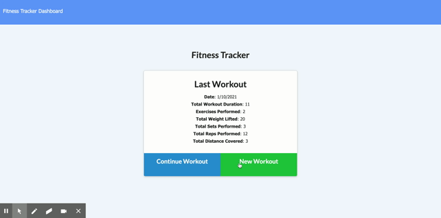
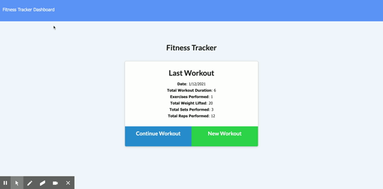

# Workout Tracker

Allows the user to track a workout. Various attributes of the workout can be stored. The workouts are saved in a Mongo database.

## Description

Created a fitness tracking app utilizing Node.js, Express.js, MongoDB, Heroku and Mongoose. Majority of the front end code was provided in a homework prompt as part of a web development boot camp. Allows the user to track their workouts and save them in a database.

## Livesite:

[application](https://pmh-workout-tracker.herokuapp.com/)

## Images

## Installation

You will need to npm init to get all the required node modules. If you are running the code locally the local host is set to port 3000. You will also need to go in to the config folder and possibly change the config.json values. The file I used to start the project is server.js.

## Usage

The project is to learn and use MongoDB and to work with a front end application for MongoDB. The project could be used as an actual workout tracking application or similar projects.

## Credits

The project was provided with the majority of the front-end development complete. The server code was developed by myself with help from my instructors and my tutor. 

## Challenges

With the help of my tutor, I wasn't presented with any major challenges. The main focus was to create the files needed to set up the server and to connect with MongoDB and Robo 3T. Also, setting up a virtual tracking was a bit of a challenge. 